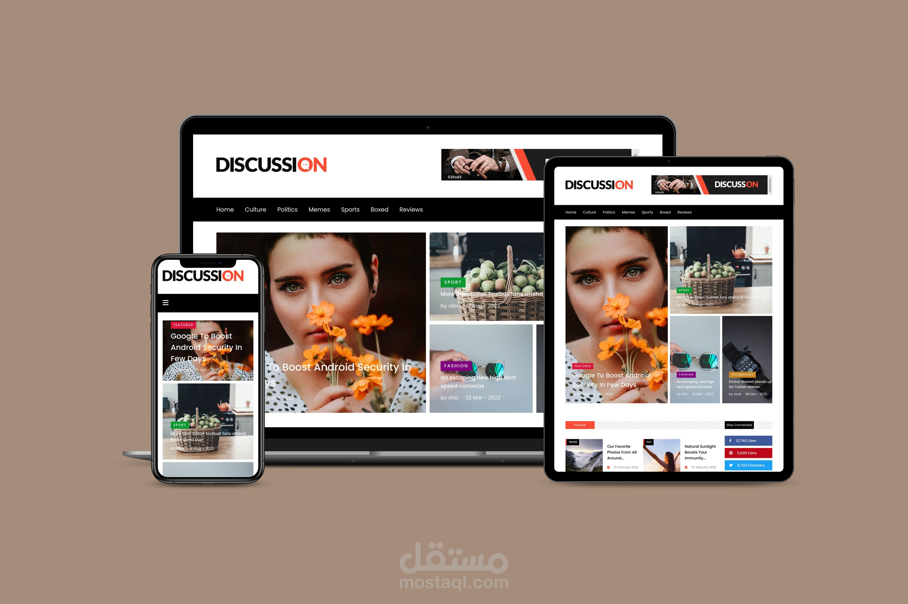

# News Website Project

This project aims to create a website for publishing news and information online. The site will be designed in a simple and user-friendly manner to provide a comfortable and seamless user experience for readers. A wide range of news from various fields such as politics, economy, sports, technology, culture, and arts will be offered.

## Project Features

- **Attractive and Responsive Design**: The site will feature an attractive and consistent user interface that allows users to easily access content regardless of the device they are using.
- **News Categorization**: News will be categorized according to a variety of categories to facilitate browsing and finding important content.
- **Continuous Updates**: The content will be regularly updated to provide the latest news and the most important and comprehensive information.
- **Search Functionality**: The search function will allow users to easily search for specific topics or articles.
- **Interactivity and Reader Comments**: Readers will be able to interact with the content by providing their comments and opinions on the issues discussed.
- **Easy Sharing**: The sharing function will allow users to easily share articles and news via social media or email.

## Getting Started

To get started with the project, follow these steps:

1. **Clone the repository**
   \`\`\`bash
   git clonehttps://github.com/Mohammed-Shaaban-Ali/News-Website.git
   \`\`\`

2. **Install dependencies**
   \`\`\`bash
   cd news-website
   npm install
   \`\`\`

3. **Set up Environment Variables**
   - Update the \`.env\` file with your configuration.

4. **Run the application**
   \`\`\`bash
   npm start
   \`\`\`

## Contributing

Contributions are welcome! Please fork the repository and submit a pull request for any improvements or bug fixes.

## License

This project is licensed under the MIT License.

